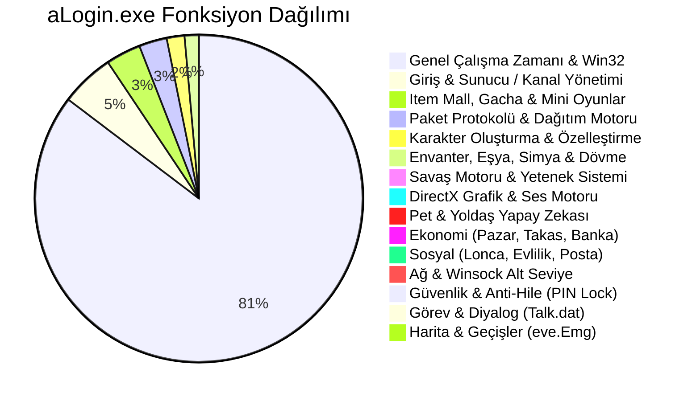

# aLogin.exe Binary Architecture & Function Map

Bu doküman, Wonderland Online istemcisi **`aLogin.exe`** binary dosyasının Ghidra ile tersine mühendislik (reverse engineering) ve decompile analizi sonucunda elde edilen ana mimari yapısını, bellek düzenini, global göstericilerini (pointers), alt sistemlerini ve yürütme akışını detaylandırmaktadır.

---

## 1. Binary ve Bölüm (PE Section) Yapısı

`aLogin.exe`, 32-bit Windows PE (Portable Executable) formatında derlenmiş bir DirectX/Winsock oyun istemcisidir.

| Bölüm Adı | Boyut | Yetki | İçerik & Amaç |
| :--- | :--- | :--- | :--- |
| **`CODE`** | ~4.83 MB (`4,829,248` B) | `RX` | Tüm decompile edilmiş fonksiyonların makine kodu (~9,106 fonksiyon). |
| **`DATA`** | ~117 KB (`117,080` B) | `RW` | Global değişkenler, durum bayrakları, oturum kimlikleri, soket göstericileri. |
| **`.reloc`** | ~298 KB (`298,392` B) | `R` | Base relocation tablosu (ASLR / dinamik yeniden konumlandırma). |
| **`.idata`** | ~11.7 KB (`11,728` B) | `R` | Import Address Table (IAT) - Winsock (`ws2_32.dll`), DirectDraw, DirectSound, Win32 GUI, Kernel32. |
| **`.rsrc`** | ~6.5 KB | `R` | İstemci ikonları, menü kaynakları, dialog şablonları. |

---

## 2. Global Bellek Göstericileri ve Veri Yapıları (State Pointers)

İstemcinin çalışma zamanındaki durumunu (runtime state) tutan kritik global göstericiler:

- **`PTR_DAT_004c87e4` (`ClientSocketContext`):**
  - İstemcinin ana ağ bağlantı soket referansını (`SOCKET fd`) ve paket gönderim kuyruklarını tutar.
  - `FUN_002d6994` ve `FUN_002f21b8` paket gönderme fonksiyonları ilk parametre olarak bu göstericiyi kullanır (`*PTR_DAT_004c87e4`).
- **`DAT_0071ef58` (`PlayerSessionData`):**
  - Aktif oturum açmış kullanıcının bilgilerini tutar.
  - Ofset `+0x268`: Oyuncu GUID / Account ID.
  - Ofset `+0x280`: Seçili Karakter ID (Character Slot ID).
  - Ofset `+0x310`: Oturum durum bayrağı (0: Offline, 1: Logged In, 2: In-Game).
- **`PTR_DAT_004c98dc` (`InventoryEquipmentContext`):**
  - Karakterin 50 yuvalık ana envanterini, giyili eşyalarını ve dayanıklılık (durability) dizilerini tutar.
  - Ofset `+0x16f1`: Eşya türü ve slot indeksleri.
- **`PTR_DAT_004c9570` (`GameWorldEngine`):**
  - Harita koordinatları (`Pos_X`, `Pos_Y`), Grid çarpışma matrisi ve aktif harita ID'si (`MapID`).
- **`PTR_DAT_004c8cf8` (`TradeContext`):**
  - P2P Güvenli Takas (Safe Trade) durumunu, karşı oyuncunun teklif ettiği eşyaları ve kilit bayraklarını barındırır.
- **`active_pet` (`0x004ca450` civarı / `+0x1efc`):**
  - Çağrılmış aktif evcil hayvanın (summoned pet) yapısı. `+0x1efc` bayrağı 1 ise pet haritada görünür ve savaş modundadır.

---

## 3. Ana Fonksiyon Alanları ve İstatistik Dağılımı

Decompile edilen 9,106 fonksiyonun alt sistemlere göre dağılımı:

---

## 4. İstemci Başlatma ve Döngü Akışı (Execution Lifecycle)

1. **`FUN_00473950` (`WinMain`):**
   - Win32 penceresi oluşturulur (`CreateWindowExA`), pencere sınıfı kaydedilir.
   - `WSAStartup` ile Winsock 2.2 başlatılır.
   - DirectDraw ve DirectSound cihazları ilklendirilir.
2. **`FUN_0032f674` (`LoadServerConfig`):**
   - Yerel `SERVER.INI` dosyası taranarak sunucu grupları ve kanalları (IP, Port, Kanal Adı) belleğe yüklenir.
3. **`FUN_000799c8` (`NetworkConnect`):**
   - Seçilen sunucunun IP adresine `25221` veya `25620` portundan non-blocking TCP soketi ile bağlanır.
4. **`FUN_0033c310` (`ProcessLogin`):**
   - Sunucudan gelen kimlik doğrulama paketini çözer. Başarılı ise Karakter Seçim ekranına geçer.
5. **Ana Mesaj Döngüsü (`MessagePump` & `RenderLoop`):**
   - `PeekMessageA` ile Windows olayları işlenir.
   - DirectDraw yüzeyine harita zemin karoları, NPC'ler ve oyuncu sprite'ları çizilir (`Flip`).
   - Gelen ağ paketleri `FUN_0007a284` ile okunup ilgili Opcode dağıtıcısına (`PacketDispatcher`) aktarılır.
