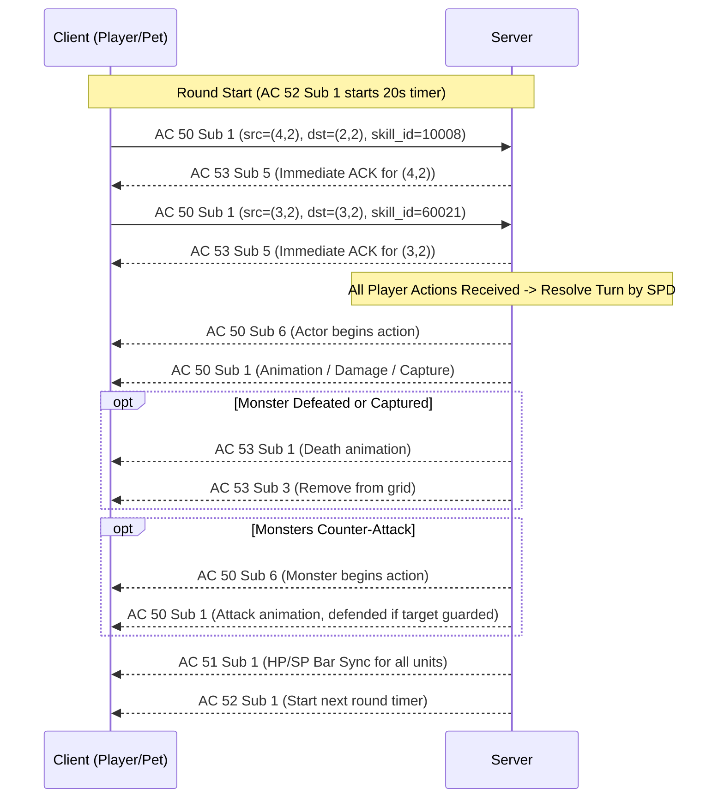

# Authentic Combat Engine & Action Protocol

This document details the reverse-engineered Wonderland Online turn-based combat engine, derived from authentic network captures (`normalfight.pcapng`, `fighttanbiryaratigikesipciktim.pcapng`, and `petyakalamakalkanfalan.pcapng`).

---

## 1. Action Submission & Protocol Lifecycle

In authentic gameplay, all combat decisions from the client arrive encapsulated in **Action Code 50, Sub-opcode 1**:

### A. Client Action Command (`C -> S AC 50 Sub 1`)
- **Size**: 11 bytes
- **Format**:
  ```
  Offset  Type       Description
  -------------------------------------------------------------
  0..1    uint8[2]   Action Code (50), Sub-opcode (1)
  2       uint8      src_x (source grid coordinate, e.g., 4=Player, 3=Pet)
  3       uint8      src_y (source grid coordinate, e.g., 2)
  4       uint8      dst_x (target grid coordinate, or src for self)
  5       uint8      dst_y (target grid coordinate, or src for self)
  6..7    uint16_LE  skill_id (Action identifier)
  8..10   uint8[3]   Nonce / Salt / UI flags
  ```

### B. Immediate Action Acknowledgement (`S -> C AC 53 Sub 5`)
To lock in player actions without UI lag, the official server immediately responds to every valid combat decision:
- **Size**: 4 bytes
- **Format**: `[0x35, 0x05, src_x, src_y]`
- **Behavior**: Client UI marks the actor as ready and locks in the selection.

---

## 2. Action Classifications & Skill IDs

| Skill ID | Hex Code | Action Type | Target | Description |
|---|---|---|---|---|
| `60021` | `0xEA75` | **Defend / Shield** | Self (`src == dst`) | Enters defensive stance. Reduces all incoming damage by 50% for the round and flags animation hits with guarded status. |
| `60041` | `0xEA89` | **Flee / Escape** | Self (`src == dst`) | Executes escape sequence, plays flee animation, and returns player safely to world map without defeat penalty. |
| `10008` | `0x2718` | **Capture / Pet Catch** | Monster (`dst_x, dst_y`) | Attempts to catch the target monster. On success, dispatches `AC 11 Sub 4` and grants companion to `session.pets`. |
| `10001` | `0x2711` | **Hand Attack** | Enemy / Self | Unarmed basic physical melee attack. |
| `10002` | `0x2712` | **Blade Attack** | Enemy | Weapon-equipped physical melee attack. |
| `10023` | `0x2727` | **Monster Attack** | Enemy | Standard monster physical attack. |
| `15060` | `0x3AD4` | **Throw Dish** | Enemy | Pet offensive skill (Earth/Rock element). |

---

## 3. Pet Capture Mechanism (`AC 11 Sub 4`)

### A. Capture Success Formula
Capture probability is calculated in [`server/battle_engine.py`](file:///d:/GitHub/Wonderland%20Online/server/battle_engine.py) (`calculate_catch_rate`):
$$\text{Rate} = \max\left(0.15, \min\left(0.95, (1.0 - \frac{\text{HP}_{\text{cur}}}{\text{HP}_{\text{max}}}) \times 0.70 + 0.15 + (\text{Lvl}_{\text{player}} - \text{Lvl}_{\text{mon}}) \times 0.02\right)\right)$$
- Monsters at 10% HP have $\ge 75\%$ capture rate.
- Level advantage increases capture rate by $+2\%$ per level.

### B. Capture Success Packet (`AC 11 Sub 4`)
- **Size**: 10 bytes
- **Format**: `[0x0B, 0x04, 0x02, mon_id (uint32_LE), 0x00, 0x00, 0x01]`
- **Server Actions**:
  1. Instantiates companion dictionary in `session.pets` with monster attributes.
  2. Persists player companions to database.
  3. Sends `AC 53 Sub 1` and `AC 53 Sub 3` removing monster sprite from the battle grid.
  4. If all enemies are captured/defeated, ends battle with victory.

---

## 4. Turn Resolution Cycle



---

## 5. Combat Termination & Victory Sequence

When all monsters are defeated or captured:
1. **Victory Trigger**: `AC 11 Sub 12` `[0x0B, 0x0C, 0x01]`.
2. **Player EXP**: `AC 8 Sub 1` `[0x08, 0x01, 0x24, 0x01, exp (uint32_LE), 0x00 * 4]`.
3. **Pet EXP**: `AC 8 Sub 2` `[0x08, 0x02, 0x04, 0x02, 0x00, 0x24, 0x01, pet_exp (uint32_LE), 0x00 * 4]`.
4. **Despawn Grid Entities**:
   - `AC 11 Sub 1`: `[0x0B, 0x01, pet_x, pet_y]` (Pet despawn).
   - `AC 11 Sub 0`: `[0x0B, 0x00, char_id (uint32_LE), 0x00, 0x00]` (Player despawn).
   - `AC 11 Sub 1`: `[0x0B, 0x01, player_x, player_y, 0x00]` (Final field clear).
5. **Map Resumption**: `AC 20 Sub 6` and `AC 20 Sub 8` restore world map controls.
