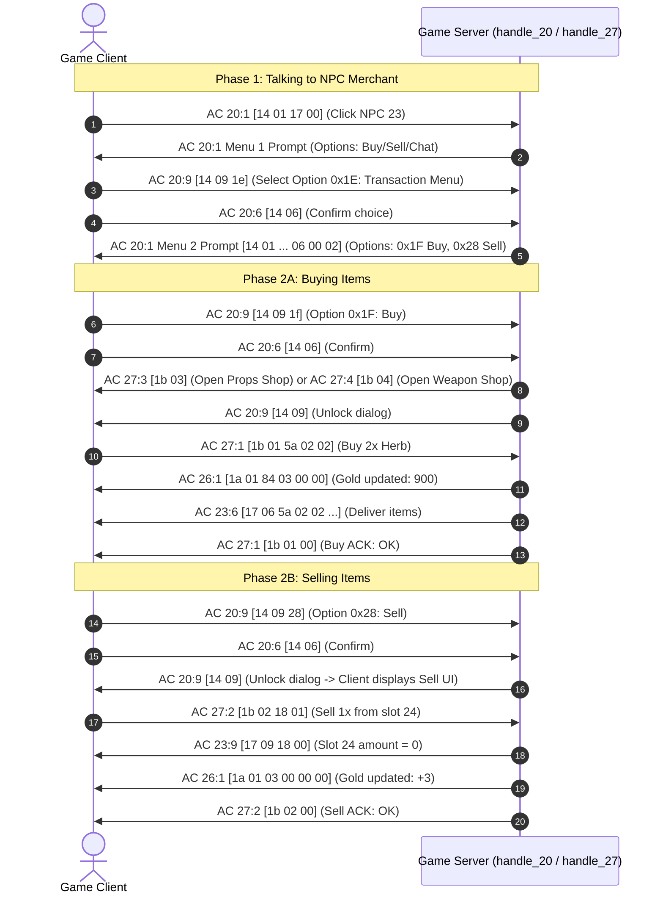

# Authentic Wonderland Online NPC Shop Protocol (AC 27 / 0x1B)

## Overview

This specification documents the authentic network protocol for interacting with NPC Merchants, browsing store catalogs, purchasing goods, and selling inventory items in Wonderland Online.
The protocol was extracted and verified directly from packet capture analysis (`shoplarincalismamantigi.pcapng`, 519 decrypted packets).

---

## 1. Action Code Overview

All NPC shop dialog actions and shop window operations utilize **Action Code 27 (0x1B)** and dialogue orchestration via **Action Code 20 (0x14)**.

| Action Code | Sub-Command | Direction | Name | Description |
| :--- | :--- | :--- | :--- | :--- |
| **20 (0x14)** | **1 (0x01)** | C -> S | NPC Interaction Click | Player clicks an NPC merchant (`14 01 [click_id: uint16 LE]`). |
| **20 (0x14)** | **1 (0x01)** | S -> C | Dialogue / Menu Prompt | Server sends menu prompt with options. |
| **20 (0x14)** | **9 / 2** | C -> S | Dialog Choice Selection | Player clicks an option (e.g. `0x1E` shop menu, `0x1F` buy, `0x28` sell). |
| **27 (0x1B)** | **3 (0x03)** | S -> C | Open Props Shop | Opens the General / Consumable Store catalog window (`1b 03`). |
| **27 (0x1B)** | **4 (0x04)** | S -> C | Open Weapon Shop | Opens the Weapon / Armor Store catalog window (`1b 04`). |
| **20 (0x14)** | **9 (0x09)** | S -> C | Release Dialogue Lock | Closes the dialogue box and restores control for shop UI (`14 09`). |
| **27 (0x1B)** | **1 (0x01)** | C -> S | Buy Item Request | Player buys item from opened catalog (`1b 01 [item_id: uint16] [amount: uint8]`). |
| **27 (0x1B)** | **1 (0x01)** | S -> C | Buy ACK | Server confirms purchase (`1b 01 [status: uint8]`, 0 = Success). |
| **27 (0x1B)** | **2 (0x02)** | C -> S | Sell Item Request | Player sells item from inventory (`1b 02 [slot_idx: uint8] [amount: uint8]`). |
| **23 (0x17)** | **9 (0x09)** | S -> C | Inventory Slot Update | Updates slot quantity after sale (`17 09 [slot: uint8] [amount: uint8]`). |
| **26 (0x1A)** | **1 (0x01)** | S -> C | Gold Balance Update | Synchronizes gold after transaction (`1a 01 [gold: uint32 LE]`). |
| **27 (0x1B)** | **2 (0x02)** | S -> C | Sell ACK | Server confirms sale (`1b 02 [status: uint8]`, 0 = Success). |

---

## 2. Interaction Sequence Diagram



---

## 3. Wire Format Specification

### 3.1 AC 27 Sub 2: Sell Item Request (Client -> Server)
```
[0x1B] [0x02] [slot_index: 1B] [amount: 1B]
Example: 1b 02 18 01 -> Sell 1 item from slot 24 (0x18)
```

### 3.2 AC 27 Sub 2: Sell Confirmation (Server -> Client)
```
[0x1B] [0x02] [status: 1B]
0x00 = Transaction successful
0x01 = Transaction failed / item not found
```

### 3.3 AC 27 Sub 1: Buy Item Request (Client -> Server)
```
[0x1B] [0x01] [item_id: 2B LE] [amount: 1B]
Optionally prefixed by shop_id and tab_id if sent by specific client versions.
```

### 3.4 AC 27 Sub 1: Buy Confirmation (Server -> Client)
```
[0x1B] [0x01] [status: 1B]
0x00 = Purchase successful
0x01 = Insufficient funds (Gold)
0x02 = Inventory full
```
